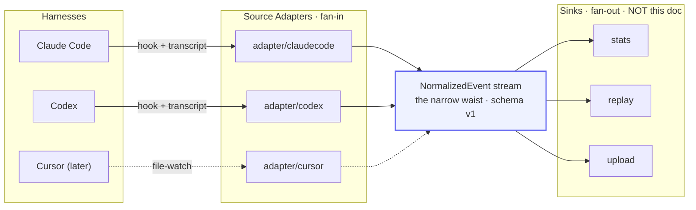
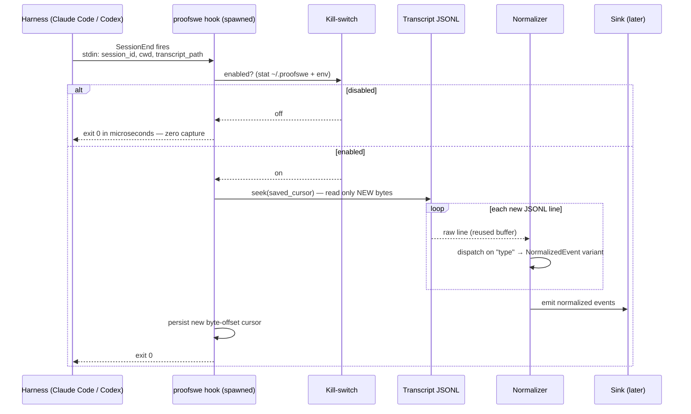
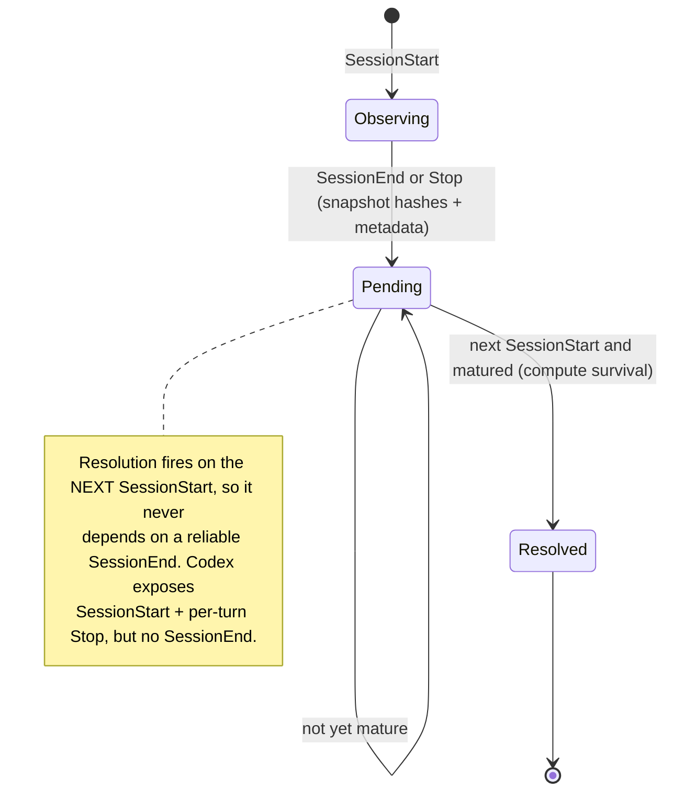
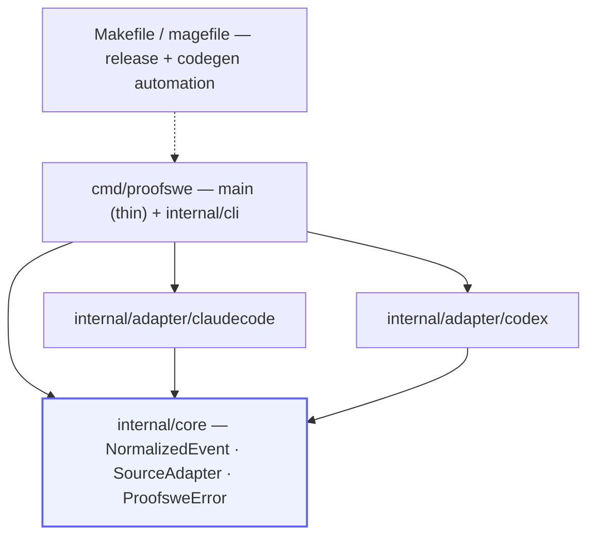

# proofswe — Data Capture Pipeline Architecture

> **Status: design exploration.** The *spine* is locked (see §1); everything else
> is a research-backed recommendation. Genuinely unsettled forks are marked
> **[OPEN]** in §10. This document covers **capture, not storage** — the pipeline
> ends at a normalized event stream; where events land and how they are redacted
> is a sink concern, deliberately out of scope.
>
> Every non-obvious decision below is backed by how the best Go people actually
> build tools like this. Sources are linked inline and collected in §11.
>
> **Language note (2026-06):** proofswe was originally scoped in Rust. We pivoted
> to **Go** because product velocity beats theoretical peak performance for a
> tool that is fundamentally I/O-bound (it reads files and shells out; it barely
> computes), and Go's distribution story (`CGO_ENABLED=0` static binaries,
> trivial `GOOS`/`GOARCH` cross-compilation) is dramatically simpler than Rust's
> musl/zig cross-build machinery. The honest trade we accept: Go pays a small,
> fixed runtime-init tax on every process spawn that Rust does not (§6.1).

---

## 1. The spine (locked)

From the design discussion, four decisions are fixed:

1. **Go binary.** A hook is a process spawned per firing, so cold-start latency
   is a hard constraint. A small static Go binary cold-starts in single-digit
   milliseconds — comfortably inside our < 50 ms hook budget (§6.1) — and with
   `CGO_ENABLED=0` it statically links into one self-contained, dependency-free
   executable per platform. (Honest caveat: Go's runtime/GC/scheduler init is a
   fixed per-spawn cost Rust avoids; we judge it irrelevant next to OS `exec` and
   the file read, and we **gate it empirically**, §6.1.)
2. **Two hooks (doorbell) + transcript (source of truth).** Hooks supply
   *lifecycle + identity + the kill-switch checkpoint*; the JSONL transcript
   supplies *content*. Minimal hook surface: `SessionStart` and
   `SessionEnd`/`Stop` only — never per-tool hooks.
3. **One adapter per harness.** The core never names a harness; it iterates
   registered `SourceAdapter`s.
4. **A narrow-waist `NormalizedEvent` schema.** Adapters fan in, sinks fan out,
   the schema is the only stable contract. Agnosticism lives in the waist, not in
   any single capture mechanism.

The payoff of making the transcript the source of truth is **graceful
degradation**: hooks are an *enhancement* over a file-watch baseline, not a hard
dependency. A harness with no hooks (Cursor) is just the file-watch row, feeding
the identical waist.

---

## 2. Architecture overview



This hourglass is the whole thesis: many messy inputs, one stable middle, many
possible outputs. The discipline that keeps it honest is **"parse, don't
validate"** — each adapter turns loose, harness-specific input into the precise
`NormalizedEvent` type exactly once, at the boundary (a `UnmarshalJSON`
dispatcher + a defined-type constructor), so nothing downstream ever re-parses or
re-validates ([Alexis King, *Parse, don't validate*](https://lexi-lambda.github.io/blog/2019/11/05/parse-don-t-validate/);
[Go adaptation](https://medium.com/@miggo-engineering/parse-dont-validate-in-practice-4b1a10177759)).

---

## 3. The capture sequence



Two properties this encodes: the **kill-switch is the first thing checked** (a
disabled proofswe costs microseconds and captures nothing), and reads are
**incremental by byte-offset cursor** (never re-read history — see §6.2).

---

## 4. Lifecycle: snapshot now, resolve later

Keeprate can't be measured at session end — the user hasn't had time to revert.
So capture is two-phase, and resolution is triggered by the **next**
`SessionStart`, which makes it robust to Codex having no `SessionEnd`.



---

## 5. The harness landscape (verified on disk, June 2026)

| Harness | Transcript on disk | Lifecycle hooks | v0 capture mechanism |
|---|---|---|---|
| **Claude Code** | `~/.claude/projects/<slug>/<session-id>.jsonl` | Yes — `SessionStart`, `SessionEnd`, `Stop`, … | hook (doorbell) + transcript (content) |
| **Codex** | `~/.codex/sessions/YYYY/MM/DD/rollout-*.jsonl` + `session_index.jsonl` | Yes — `SessionStart`, per-turn `Stop`, `PreToolUse`… (user-level only for telemetry hooks) | hook + transcript; resolve-on-next-start |
| **Cursor** | `state.vscdb` (SQLite, Electron) | No | file-watch + SQLite adapter (deferred) |

Claude Code and Codex have **converged** — both give date/project-organized JSONL
plus a near-identical hook vocabulary — so v0 is two *configurations* of one
design. Cursor is the outlier and the reason the file-watch degradation path
exists. ([Codex rollout format](https://deepwiki.com/openai/codex/3.5.2-rollout-persistence-and-replay),
[Codex hooks](https://developers.openai.com/codex/hooks).)

---

## 6. Component design

### 6.1 Runtime & cold-start

The dominant constraint is process startup, not throughput. Concrete levers,
strongest first:

- **Build a fully static binary with `CGO_ENABLED=0`.** This is Go's headline win
  over Rust: a pure-Go build with cgo disabled statically links the runtime and
  uses Go's native `net`/`os/user` resolvers instead of libc, so the binary
  "just works" on any matching `GOOS`/`GOARCH` with **no musl, no zig, no C
  cross-compiler** ([cgo docs](https://pkg.go.dev/cmd/cgo),
  [CGO_ENABLED=0 → pure-Go resolver](https://github.com/golang/go/issues/57007),
  [static-binary overview](https://eli.thegreenplace.net/2024/building-static-binaries-with-go-on-linux/)).
- **Strip and trim every release build:** `go build -trimpath -ldflags="-s -w"`.
  `-s -w` drop the symbol table and DWARF debug info (~25–30% smaller, zero
  runtime cost); `-trimpath` removes local filesystem paths (smaller + more
  reproducible, §6.7) ([build flags](https://pkg.go.dev/cmd/go#hdr-Build_flags),
  [linker `-s`/`-w`](https://pkg.go.dev/cmd/link)). Keep symbols in dev builds for
  pprof/stack traces.
- **Do not UPX-compress the binary.** UPX packing is a known malware signature
  (AV/EDR false positives) and its per-invocation decompression *increases*
  startup latency — directly fighting the hook budget
  ([trade-offs](https://dev.to/aryaprakasa/the-trade-offs-of-optimizing-and-compressing-go-binaries-492d)).
- **Do not reach for a heavyweight CLI framework.** For a fixed, small subcommand
  set, the stdlib [`flag`](https://pkg.go.dev/flag) package with manual
  `os.Args[1]` dispatch — or the deliberately lightweight
  [`peterbourgon/ff`/`ffcli`](https://pkg.go.dev/github.com/peterbourgon/ff/v3/ffcli)
  or declarative [`alecthomas/kong`](https://github.com/alecthomas/kong) — keeps
  the dependency tree and binary tiny. Avoid [`spf13/cobra`](https://github.com/spf13/cobra):
  it is the de-facto standard but the heaviest option (pflag + transitive deps),
  overkill for a handful of commands. This mirrors the original Rust decision to
  skip `clap` in favour of `lexopt`/`pico-args`.
- **Leave the GC at defaults; set `GOMEMLIMIT` as a safety belt.** For a process
  that starts, streams a file, and exits in well under a second, the default
  `GOGC=100` collector barely runs. Do **not** use `GOGC=off` — we stream
  multi-GB JSONL and want bounded memory, not unbounded transient garbage. Set a
  soft ceiling (e.g. `GOMEMLIMIT=512MiB`) so a pathological input can't blow
  memory ([Go GC guide](https://go.dev/doc/gc-guide),
  [runtime env vars](https://pkg.go.dev/runtime#hdr-Environment_Variables)).
- **Gate cold-start as a tracked metric** with
  [`hyperfine --shell=none`](https://github.com/sharkdp/hyperfine) (language-
  agnostic — it lets us A/B the Go build against the retired Rust prototype). Go's
  *runtime* init is the small single-digit-ms component, not the headline "cold
  start" numbers you see online (those are serverless VM cold starts — do not
  conflate) ([runtime-init measurement](https://elsyarifx.medium.com/how-we-cut-our-go-api-cold-start-time-from-200ms-to-5ms-0b553ecb7212),
  [Go startup investigation](https://blog.replit.com/golang-performance)).
  Existence proof that per-invocation Go CLIs are fast enough: `fzf` (filters on
  every keystroke) and `gh` ship as single static Go binaries.

### 6.2 Reading transcripts at scale

Codex rollouts reach **700 MB–2 GB** (their [issue #24948](https://github.com/openai/codex/issues/24948)),
and a sibling tool already has a bug from reading whole session files into memory
([ccusage #1124](https://github.com/ryoppippi/ccusage/issues/1124)) — so
constant-memory streaming is the differentiator, not premature optimization.

- **Read path:** `bufio.Reader.ReadBytes('\n')` (or `ReadString('\n')`) over the
  open `*os.File`, decoding each line with `json.Unmarshal`. **Do not use
  `bufio.Scanner`** for this: its default token cap is `MaxScanTokenSize = 64 KB`
  and a single fat JSONL record longer than that aborts the scan with
  `bufio.ErrTooLong` — the most famous Go footgun, and a real risk here
  ([bufio docs](https://pkg.go.dev/bufio),
  [64 KB NDJSON bug](https://github.com/olivere/ndjson/issues/2)). `ReadBytes`
  handles arbitrarily long lines with no fixed cap. Reuse a single decode target
  / scratch buffer across lines to amortize allocation (Go's
  `-benchmem`-measurable analog of the buffer-reuse trick).
- **Resume cursor:** persist the **byte offset of the last *fully parsed* line**;
  next pass `Seek` there and parse only new bytes. The direct equivalent of
  serde_json's byte offset is
  [`json.Decoder.InputOffset()`](https://pkg.go.dev/encoding/json) (added in
  [golang/go#29688](https://github.com/golang/go/issues/29688)) if you decode via
  a streaming `json.Decoder`; with the `ReadBytes` path you accumulate the offset
  yourself. **Never advance the cursor past a trailing partial line** (a
  half-written final event surfaces as a short read / EOF) so it is re-read once
  complete.
- **Never `mmap` the live file.** This is the single most important safety point:
  memory-mapping a file that is being appended to or truncated risks **SIGBUS
  (unrecoverable process abort)** — the *exact* hazard Rust's `memmap2` carries,
  and Go is no safer ([`golang.org/x/exp/mmap`](https://pkg.go.dev/golang.org/x/exp/mmap),
  [SIGBUS on truncation](https://zuff.dev/posts/sigbus/),
  [Go runtime SIGBUS](https://github.com/golang/go/issues/29208)). A session JSONL
  grows *while you read it*, so mmap would turn "the agent is still typing" into a
  crash. Buffered reads only.
- **Faster JSON as an opt-in, not the default.** Keep stdlib `encoding/json` as
  the always-available default (zero deps, every arch, full compatibility). If
  profiling (`go test -bench -benchmem` + `pprof`, §6 below) shows JSON decode
  dominates on multi-GB files, swap in a faster decoder behind a build tag:
  [`goccy/go-json`](https://github.com/goccy/go-json) is a pure-Go **drop-in**
  replacement (same API), [`bytedance/sonic`](https://github.com/bytedance/sonic)
  is the fastest (JIT + SIMD, amd64/arm64 only, falls back to stdlib elsewhere),
  and [`valyala/fastjson`](https://github.com/valyala/fastjson) /
  [`buger/jsonparser`](https://github.com/buger/jsonparser) are **zero-alloc**
  field extractors — ideal if a sink only pulls a few fields per huge line.

### 6.3 Modeling the events

- **A "sealed interface" with a catch-all variant.** Go has no sum types, so model
  `NormalizedEvent` as an interface with an **unexported marker method** — only
  types in `internal/core` can implement it, closing the variant set at compile
  time (the idiomatic stand-in for a Rust enum). Decode harness records
  (`{"type": "...", ...}`) with a **two-pass `UnmarshalJSON`**: probe `{"type"}`
  first, then `json.Unmarshal` into the concrete variant; route an unknown
  discriminator to `Unknown{ Type string; Raw json.RawMessage }` so old binaries
  survive new event types instead of erroring — the forward-compat property that
  Rust got from `#[serde(other)]`
  ([sum types in Go](https://rodusek.com/posts/2024/12/14/go-tip-creating-closed-interfaces/),
  [JSON sum-type dispatch](https://nicolashery.com/decoding-json-sum-types-in-go/),
  [`json.RawMessage`](https://pkg.go.dev/encoding/json#RawMessage)).
- **Be lenient with fields.** Stdlib `encoding/json` **ignores unknown object
  keys by default** — exactly what we want for evolving formats. **Never** call
  `Decoder.DisallowUnknownFields()` on event structs
  ([encoding/json docs](https://pkg.go.dev/encoding/json)).
- **Separate *raw* per-harness types from `NormalizedEvent`.** Each adapter owns
  Go structs matching its harness's quirks, then *parses* into the shared
  interface — don't overload one type with both jobs (parse-don't-validate, §2).
- **Forward-compat lives in the decoder, not the type system.** Go can't force a
  downstream `switch` to handle a future variant (no `#[non_exhaustive]`), so the
  `Unknown` catch-all is load-bearing. Enforce exhaustiveness in *our own* sinks
  with the [`go-check-sumtype`](https://github.com/alecthomas/go-check-sumtype)
  linter (sealed-interface type switches) and
  [`exhaustive`](https://github.com/nishanths/exhaustive) (iota enums), both wired
  through `golangci-lint`.
- **Defined-type identifiers** (no bare `string`): `type SessionId string`,
  `type ToolCallId string`, `type HarnessName string`, `type ModelId string` — a
  distinct type at zero runtime cost, so a tool-result id can't be miswired to a
  session id.

### 6.4 The adapter pattern: closed events, open adapters

Split the dispatch decision by axis:

- **`NormalizedEvent` is a sealed interface** — we own every variant, want an
  exhaustive type `switch` in sinks (lint-enforced, §6.3), and a closed set.
- **`SourceAdapter` is an interface**, invoked from a `[]SourceAdapter` registry
  — adapters are an open set that grows without touching the core.

Accept the expression-problem asymmetry consciously: adding an **event variant**
is expensive (every sink's `switch` updates) but adding a **sink** or a
**harness** is cheap. So keep the waist small and stable; let growth happen at the
edges.

### 6.5 Error handling

- **Typed errors in `core`/adapters, wrap-and-bubble in the `cli`.** This is the
  Go spelling of the Rust "thiserror in libraries, anyhow in the binary" split.
  Libraries define sentinel errors (`var ErrFoo = errors.New(...)`) and custom
  error types implementing `error`; callers branch with `errors.Is` /
  `errors.As`, and combine independent failures with `errors.Join` (Go 1.20+).
  The orchestrator needs this to decide *skip a bad record vs abort the session*.
  The CLI just wraps with context — `fmt.Errorf("reading transcript: %w", err)` —
  and handles once near `main`
  ([Working with Errors in Go 1.13](https://go.dev/blog/go1.13-errors),
  [Error handling and Go](https://go.dev/blog/error-handling-and-go)).
- **Model the core error like `io.Error`/`fs.PathError`:** an opaque type exposing
  a `Kind() ErrorKind` accessor (assert for it with `errors.As`) rather than
  leaking internals — Dave Cheney's "assert on behaviour, not type"
  ([handle errors gracefully](https://dave.cheney.net/2016/04/27/dont-just-check-errors-handle-them-gracefully)).
  Go returns the cheap `error` interface, so there's no `size_of::<Result>`
  penalty to engineer around.

### 6.6 Package structure



A **single Go module** with the binary entrypoint at `cmd/proofswe/main.go` and
all logic under `internal/`. `internal/` is the **only compiler-enforced
boundary** in Go — packages there cannot be imported from outside the module —
giving the same encapsulation Rust crates gave us with zero ceremony
([official module layout](https://go.dev/doc/modules/layout)). Skip the contested
`golang-standards/project-layout` and especially `pkg/`: there's no public library
to export ([Russ Cox on why](https://github.com/golang-standards/project-layout/issues/117)).
`internal/core` is the **API boundary**: dependencies flow one way (`adapter/* →
core ← cli`), adapters never depend on each other, and all IO/serialization
knowledge lives in adapters and the CLI — `core` stays pure. A multi-module
`go.work` setup is **not** warranted for one binary
([workspaces are for local multi-module dev](https://go.dev/doc/tutorial/workspaces)).
Build automation that would have been a Rust `xtask` becomes a **`Makefile`** (thin
orchestration of `go` commands) or, if we want automation written in Go itself,
[`magefile/mage`](https://github.com/magefile/mage). Once event variants
proliferate, generate them from one declarative source via `go:generate` rather
than hand-maintaining structs.

### 6.7 Distribution

- **Use [GoReleaser](https://goreleaser.com/) as the single release orchestrator**
  (the Go-ecosystem replacement for cargo-dist). One config emits the
  cross-compile matrix, GitHub Releases, archives + checksums,
  [Homebrew](https://goreleaser.com/customization/publish/homebrew_casks/) taps,
  Scoop buckets, and `.deb`/`.rpm`/`.apk` via [nfpm](https://nfpm.goreleaser.com/),
  wired into [GitHub Actions](https://goreleaser.com/ci/actions/).
- **Cross-compile is trivial:** `CGO_ENABLED=0 GOOS=… GOARCH=… go build`. We
  **drop the entire musl/zig/cargo-zigbuild layer** the Rust plan needed —
  pure-Go static binaries cross-compile with the native toolchain.
- **npm / `npx proofswe` uses the esbuild per-platform pattern.** A root package
  declares `@proofswe/cli-<os>-<arch>` packages as `optionalDependencies`; npm
  installs only the matching one and a tiny launcher resolves the binary — no
  postinstall network fetch ([esbuild PR #1621](https://github.com/evanw/esbuild/pull/1621),
  [Sentry write-up](https://sentry.engineering/blog/publishing-binaries-on-npm)).
  This pattern is language-agnostic and ports verbatim from the Rust plan.
  **Note:** GoReleaser's *native* npm publishing is Pro-only and uses a
  postinstall-download model (breaks under `npm i --ignore-scripts`), so the
  esbuild-style npm wrapper stays a **separate small step** after GoReleaser
  ([GoReleaser npm](https://goreleaser.com/customization/npm/)). Document the
  `--omit=optional` footgun for users.
- **Provenance & reproducibility:** publish npm with `--provenance` (Sigstore-
  backed SLSA attestation from CI) ([npm provenance](https://docs.npmjs.com/generating-provenance-statements/));
  for the binaries, `-trimpath` plus a pinned `toolchain` directive in `go.mod`
  (Go 1.21+) gives byte-stable, reproducible builds
  ([Go toolchain](https://go.dev/doc/toolchain)).
- **Version stamping:** baseline VCS info (commit, dirty flag, build time) comes
  free from [`runtime/debug.ReadBuildInfo()`](https://pkg.go.dev/runtime/debug#ReadBuildInfo)
  (Go 1.18+); inject the human-readable release tag with
  `-ldflags "-X main.version=$TAG"` ([linker docs](https://pkg.go.dev/cmd/link)).
  Prefer the ldflags value if set, else fall back to `ReadBuildInfo`.

### 6.8 Ecosystem packages

| Need | Pick | Why / source |
|---|---|---|
| File-watch (Cursor / no-hook path) | [`fsnotify`](https://github.com/fsnotify/fsnotify) | de-facto standard (analog of Rust's `notify`). **Caveats we own:** non-recursive on Linux (walk + `Add()` each subdir, re-add new dirs), watch the inotify `max_user_watches` limit, and **debounce** editor save-storms ourselves ([recursive-watcher pattern](https://medium.com/@utkarshkrsingh/building-a-recursive-file-watcher-in-go-using-fsnotify-ac8f166842cc)) |
| Git diff/log/status | **`os/exec` → `git`** (default), [`go-git`](https://github.com/go-git/go-git) (embedded/static) | Shelling `git diff --numstat` / `status --porcelain` always matches the user's git, zero deps, trivially correct. Reach for pure-Go `go-git` only where we want zero external-git dependency (keeps the static binary self-contained); it can be memory-heavy on huge repos and lacks some porcelain. **Avoid [`git2go`](https://github.com/libgit2/git2go)** — it pulls in CGO and breaks `CGO_ENABLED=0` |
| Scope, line/file counts | [`gocloc`](https://github.com/hhatto/gocloc) (as a library) | Go's cloc/`tokei` equivalent: gitignore-aware, language-aware line counting so comments/blanks don't inflate "code changed" |
| Scope, structural (later) | [`tree-sitter` Go bindings](https://github.com/tree-sitter/go-tree-sitter) | AST-level edit counts; spike the binding's build story first (some bring cgo — re-evaluate against the static-binary goal) |
| Config edits (enable/disable) | stdlib `encoding/json` for `~/.claude/settings.json`; [`pelletier/go-toml/v2`](https://github.com/pelletier/go-toml) (or [`BurntSushi/toml`](https://github.com/BurntSushi/toml)) for `~/.codex/config.toml` | round-trip-preserving edits so `disable` removes only proofswe's tagged entries |
| JSON Schema artifact | [`invopop/jsonschema`](https://github.com/invopop/jsonschema) | reflects Go types into JSON Schema Draft 2020-12 (the `schemars` replacement); emit a versioned schema in CI |

---

## 7. Enable, disable, and the kill-switch (on-by-default, ethically)


An on-by-default capture tool lives or dies on trust, so this is a survival
requirement, not a footnote:

1. **Two-layer disable.** (a) A **soft kill-switch** read as the first line of
   every hook (`~/.proofswe/config: enabled=false` or `PROOFSWE_OFF=1`) → exit 0
   in microseconds, zero capture. (b) A **hard uninstall** that unregisters hooks.
2. **Idempotent, tagged registration** into `~/.claude/settings.json` and
   `~/.codex/config.toml` so `disable` removes *only* proofswe's entries. (Codex
   forbids machine-local telemetry hooks in *project* config — register at user
   level only.)
3. **Per-repo opt-out** via a `.proofswe-ignore` marker.
4. **Loud by default** — `SessionStart` prints a one-line "observing locally ·
   disable: `proofswe off`". On-by-default *and silent* is the malware shape.
5. **Local-only, metadata-first.** No network in the capture path; content
   capture and any upload are separate, explicit, later consent moments.

---

## 8. End-to-end recommended stack (the short version)

- **Runtime:** Go, `CGO_ENABLED=0` static build, `-trimpath -ldflags="-s -w"`,
  stdlib `flag`/`ffcli`/`kong` (not cobra), `GOMEMLIMIT` safety belt, hyperfine
  cold-start gate.
- **Read:** `bufio.Reader.ReadBytes('\n')` into a reused buffer + `json.Unmarshal`;
  byte-offset resume cursor (`json.Decoder.InputOffset()` or manual); **never mmap
  the live file**; faster JSON (`goccy/go-json` / `sonic`) opt-in behind a build
  tag.
- **Model:** sealed interface + two-pass `UnmarshalJSON` + `Unknown{Raw}`
  catch-all, lenient fields, defined-type ids, raw-types-then-normalize;
  exhaustiveness via `go-check-sumtype`.
- **Shape:** interface events / interface adapters / slice registry; single module,
  pure `internal/core`; typed errors in core, `%w`-wrapping in cli.
- **Ship:** GoReleaser (brew + scoop + nfpm) + esbuild-style npm step;
  `CGO_ENABLED=0 GOOS/GOARCH` (no musl/zig); `os/exec`+`git` (or `go-git`).

---

## 9. Module sketch (illustrative, not final)

```
proofswe/
  go.mod                        # single module: github.com/Atharva-Kanherkar/proofswe
  cmd/
    proofswe/main.go            # thin entrypoint: arg dispatch → internal/cli
  internal/
    core/                       # NormalizedEvent, SourceAdapter, ProofsweError — the waist
    reader/                     # streaming JSONL reader + byte-offset cursor
    adapter/
      claudecode/               # ~/.claude/projects/*.jsonl + hook registration
      codex/                    # ~/.codex/sessions/**/rollout-*.jsonl + hook registration
    cli/                        # enable/disable/off, hook entrypoints, stats
  Makefile (or magefile.go)     # release + codegen automation
  .goreleaser.yaml              # multi-channel release config
```

---

## 10. Open decisions

1. **The proxy tier** — a model-API interceptor (`ANTHROPIC_BASE_URL` →
   localhost) is the only *truly* universal + stable-contract capture, but it
   doesn't see the git outcome and is invasive. Roadmap it or drop it?
2. **Default consent tier** — metadata + line-hashes only (safest for
   on-by-default), or metadata + redacted content from day one?
3. **`DO_NOT_TRACK` semantics for consent tiers** — full hook disable (current
   v0 behavior, zero capture) vs default-tier-only capture with all content tiers
   disabled. Phase A must continue surfacing this instead of silently treating a
   browser-style signal as granular consent.
4. **Task scope metric** — whether a reproducible task's scope should be measured
   as line/file counts, structural AST edits, prompt complexity, or a hybrid. Keep
   this separate from keeprate so "small but hard" and "large but mechanical" do
   not collapse into one number.
5. **Faster-JSON library** — opt-in build tag only, or default to `goccy/go-json`
   once benchmarked on real 2 GB rollouts? (`sonic` is amd64/arm64-only, which
   affects the cross-compile matrix.)
6. **`os/exec` git vs `go-git`** — pending a `status`/`diff` ergonomics +
   correctness spike; the trade is "matches user's git exactly" vs "no external
   git dependency / fully self-contained binary."

---

## 11. References

**Cold-start, build & CLI craft**
- Go cgo / `CGO_ENABLED`: https://pkg.go.dev/cmd/cgo · pure-Go resolver under CGO_ENABLED=0: https://github.com/golang/go/issues/57007
- Static binaries on Linux (Bendersky): https://eli.thegreenplace.net/2024/building-static-binaries-with-go-on-linux/ · arp242, static-go: https://www.arp242.net/static-go.html
- Go build flags (`-trimpath`): https://pkg.go.dev/cmd/go#hdr-Build_flags · linker `-s`/`-w`: https://pkg.go.dev/cmd/link
- UPX trade-offs (AV + startup): https://dev.to/aryaprakasa/the-trade-offs-of-optimizing-and-compressing-go-binaries-492d
- CLI parsers — stdlib flag: https://pkg.go.dev/flag · ff/ffcli: https://pkg.go.dev/github.com/peterbourgon/ff/v3/ffcli · kong: https://github.com/alecthomas/kong · cobra (heavy): https://github.com/spf13/cobra
- Go GC guide (GOGC / GOMEMLIMIT): https://go.dev/doc/gc-guide · runtime env vars: https://pkg.go.dev/runtime#hdr-Environment_Variables
- Go runtime-init vs infra cold start: https://elsyarifx.medium.com/how-we-cut-our-go-api-cold-start-time-from-200ms-to-5ms-0b553ecb7212 · https://blog.replit.com/golang-performance
- sharkdp — hyperfine: https://github.com/sharkdp/hyperfine
- Dave Cheney — High Performance Go Workshop: https://dave.cheney.net/high-performance-go-workshop/dotgo-paris.html

**Streaming & parsing**
- bufio (`MaxScanTokenSize`, `ReadBytes`): https://pkg.go.dev/bufio · 64 KB NDJSON limit bug: https://github.com/olivere/ndjson/issues/2
- encoding/json (`Decoder`, `InputOffset`, `RawMessage`): https://pkg.go.dev/encoding/json · InputOffset proposal: https://github.com/golang/go/issues/29688
- mmap (`golang.org/x/exp/mmap`): https://pkg.go.dev/golang.org/x/exp/mmap · SIGBUS on truncation: https://zuff.dev/posts/sigbus/ · Go runtime SIGBUS: https://github.com/golang/go/issues/29208
- Faster JSON: goccy/go-json (drop-in): https://github.com/goccy/go-json · bytedance/sonic: https://github.com/bytedance/sonic · valyala/fastjson: https://github.com/valyala/fastjson · buger/jsonparser: https://github.com/buger/jsonparser
- ccusage #1124 (whole-file read bug): https://github.com/ryoppippi/ccusage/issues/1124

**Architecture, modeling & errors**
- Sum types / closed interfaces in Go: https://rodusek.com/posts/2024/12/14/go-tip-creating-closed-interfaces/ · https://appliedgo.net/spotlight/sum-types-in-go/
- JSON sum-type dispatch (Hery): https://nicolashery.com/decoding-json-sum-types-in-go/
- Exhaustiveness linters: go-check-sumtype: https://github.com/alecthomas/go-check-sumtype · exhaustive: https://github.com/nishanths/exhaustive
- Alexis King — Parse, don't validate: https://lexi-lambda.github.io/blog/2019/11/05/parse-don-t-validate/ · Go adaptation: https://medium.com/@miggo-engineering/parse-dont-validate-in-practice-4b1a10177759
- Go errors: Working with Errors in Go 1.13: https://go.dev/blog/go1.13-errors · Error handling and Go: https://go.dev/blog/error-handling-and-go · `errors.Join`: https://pkg.go.dev/errors#Join
- Dave Cheney — handle errors gracefully: https://dave.cheney.net/2016/04/27/dont-just-check-errors-handle-them-gracefully · inspecting errors: https://dave.cheney.net/2014/12/24/inspecting-errors
- Module layout: https://go.dev/doc/modules/layout · Russ Cox on project-layout: https://github.com/golang-standards/project-layout/issues/117 · workspaces: https://go.dev/doc/tutorial/workspaces
- mage: https://github.com/magefile/mage · invopop/jsonschema: https://github.com/invopop/jsonschema

**Testing & quality**
- Table-driven tests: https://go.dev/wiki/TableDrivenTests · subtests: https://go.dev/blog/subtests
- Golden files (Hashimoto, Advanced Testing with Go): https://speakerdeck.com/mitchellh/advanced-testing-with-go · gotest.tools/golden: https://pkg.go.dev/gotest.tools/v3/golden
- google/go-cmp: https://github.com/google/go-cmp
- Native fuzzing: https://go.dev/doc/tutorial/fuzz · https://go.dev/doc/security/fuzz/
- Property testing — rapid: https://github.com/flyingmutant/rapid · gopter: https://github.com/leanovate/gopter
- golangci-lint: https://golangci-lint.run/ · staticcheck: https://staticcheck.dev/ · gofumpt: https://github.com/mvdan/gofumpt · govulncheck: https://go.dev/blog/govulncheck
- actions/setup-go: https://github.com/actions/setup-go

**Distribution & git**
- GoReleaser: https://goreleaser.com/ · Homebrew casks: https://goreleaser.com/customization/publish/homebrew_casks/ · nfpm: https://nfpm.goreleaser.com/ · npm (Pro): https://goreleaser.com/customization/npm/
- esbuild platform packages (PR #1621): https://github.com/evanw/esbuild/pull/1621 · Sentry — publishing binaries on npm: https://sentry.engineering/blog/publishing-binaries-on-npm
- npm provenance: https://docs.npmjs.com/generating-provenance-statements/ · Go toolchain/reproducibility: https://go.dev/doc/toolchain
- Version stamping — ReadBuildInfo: https://pkg.go.dev/runtime/debug#ReadBuildInfo
- go-git: https://github.com/go-git/go-git · git2go (avoid, CGO): https://github.com/libgit2/git2go · fsnotify: https://github.com/fsnotify/fsnotify
- gocloc: https://github.com/hhatto/gocloc · tree-sitter Go bindings: https://github.com/tree-sitter/go-tree-sitter
- pelletier/go-toml: https://github.com/pelletier/go-toml · BurntSushi/toml: https://github.com/BurntSushi/toml

**Harness formats**
- Codex rollout persistence: https://deepwiki.com/openai/codex/3.5.2-rollout-persistence-and-replay · Codex hooks: https://developers.openai.com/codex/hooks · Codex log-size #24948: https://github.com/openai/codex/issues/24948
