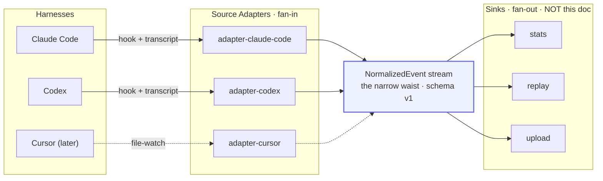
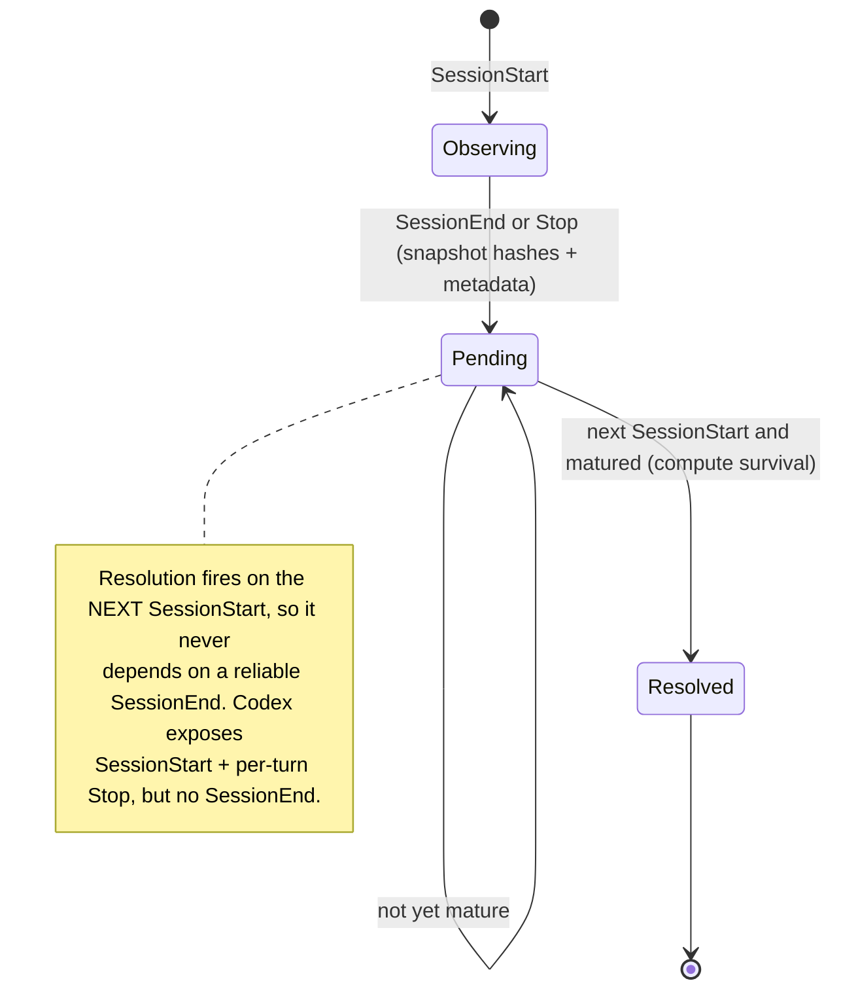
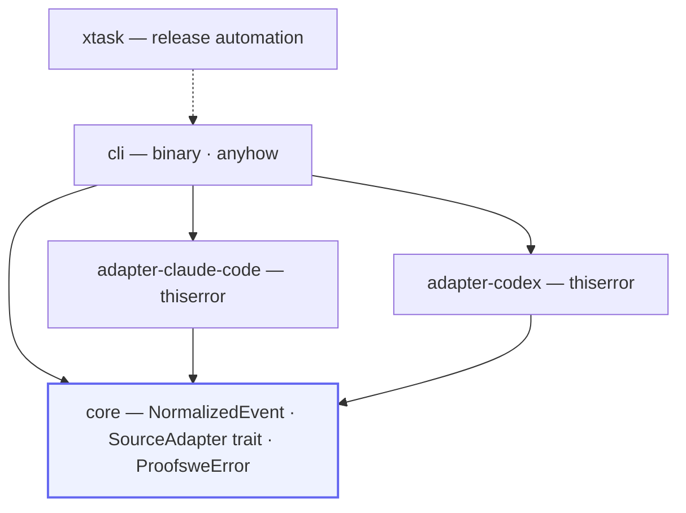
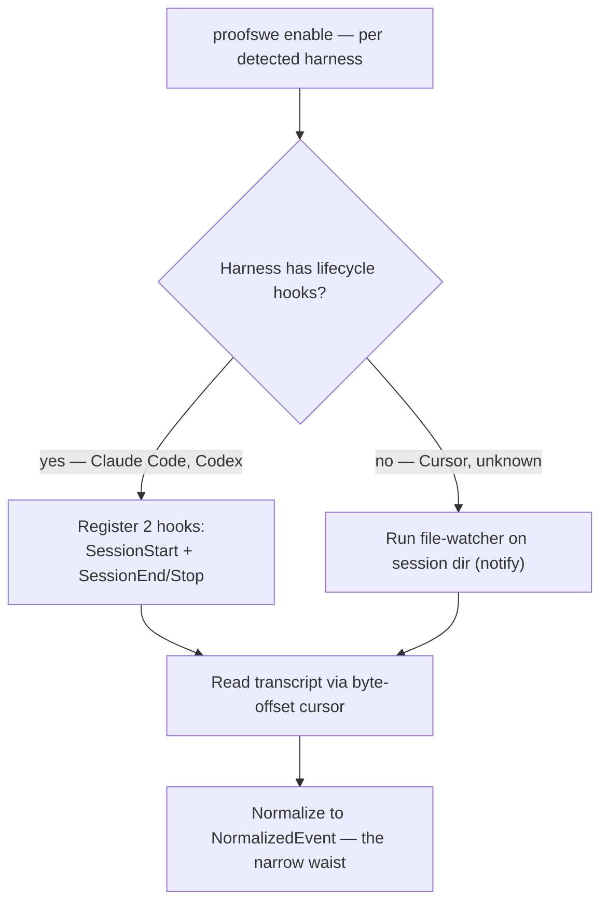

# proofswe — Data Capture Pipeline Architecture

> **Status: design exploration.** The *spine* is locked (see §1); everything else
> is a research-backed recommendation. Genuinely unsettled forks are marked
> **[OPEN]** in §10. This document covers **capture, not storage** — the pipeline
> ends at a normalized event stream; where events land and how they are redacted
> is a sink concern, deliberately out of scope.
>
> Every non-obvious decision below is backed by how the best Rust people actually
> build tools like this. Sources are linked inline and collected in §11.

---

## 1. The spine (locked)

From the design discussion, four decisions are fixed:

1. **Rust binary.** A hook is a process spawned per firing, so cold-start latency
   is a hard constraint; Rust starts in ~ms and statically links into one
   self-contained binary.
2. **Two hooks (doorbell) + transcript (source of truth).** Hooks supply
   *lifecycle + identity + the kill-switch checkpoint*; the JSONL transcript
   supplies *content*. Minimal hook surface: `SessionStart` and
   `SessionEnd`/`Stop` only — never per-tool hooks.
3. **One adapter per harness.** The core never names a harness; it iterates
   registered `SourceAdapter`s.
4. **A narrow-waist `NormalizedEvent` schema.** Adapters fan in, sinks fan out,
   the schema is the only stable contract. Agnosticism lives in the waist, not in
   any single capture mechanism.

The payoff of making the transcript the source of truth is **graceful
degradation**: hooks are an *enhancement* over a file-watch baseline, not a hard
dependency. A harness with no hooks (Cursor) is just the file-watch row, feeding
the identical waist.

---

## 2. Architecture overview



This hourglass is the whole thesis: many messy inputs, one stable middle, many
possible outputs. The discipline that keeps it honest is **"parse, don't
validate"** — each adapter turns loose, harness-specific input into the precise
`NormalizedEvent` type exactly once, at the boundary, so nothing downstream ever
re-parses or re-validates ([Alexis King, *Parse, don't validate*](https://lexi-lambda.github.io/blog/2019/11/05/parse-don-t-validate/);
[Rust application](https://entropicdrift.com/blog/refined-types-parse-dont-validate/)).

---

## 3. The capture sequence


Two properties this encodes: the **kill-switch is the first thing checked** (a
disabled proofswe costs microseconds and captures nothing), and reads are
**incremental by byte-offset cursor** (never re-read history — see §6.2).

---

## 4. Lifecycle: snapshot now, resolve later

Keeprate can't be measured at session end — the user hasn't had time to revert.
So capture is two-phase, and resolution is triggered by the **next**
`SessionStart`, which makes it robust to Codex having no `SessionEnd`.



---

## 5. The harness landscape (verified on disk, June 2026)

| Harness | Transcript on disk | Lifecycle hooks | v0 capture mechanism |
|---|---|---|---|
| **Claude Code** | `~/.claude/projects/<slug>/<session-id>.jsonl` | Yes — `SessionStart`, `SessionEnd`, `Stop`, … | hook (doorbell) + transcript (content) |
| **Codex** | `~/.codex/sessions/YYYY/MM/DD/rollout-*.jsonl` + `session_index.jsonl` | Yes — `SessionStart`, per-turn `Stop`, `PreToolUse`… (user-level only for telemetry hooks) | hook + transcript; resolve-on-next-start |
| **Cursor** | `state.vscdb` (SQLite, Electron) | No | file-watch + SQLite adapter (deferred) |

Claude Code and Codex have **converged** — both give date/project-organized JSONL
plus a near-identical hook vocabulary — so v0 is two *configurations* of one
design. Cursor is the outlier and the reason the file-watch degradation path
exists. ([Codex rollout format](https://deepwiki.com/openai/codex/3.5.2-rollout-persistence-and-replay),
[Codex hooks](https://developers.openai.com/codex/hooks).)

---

## 6. Component design

### 6.1 Runtime & cold-start

The dominant constraint is process startup, not throughput. Concrete levers,
strongest first:

- **Ship a max-optimization release profile.** Start from
  [ripgrep's actual distributed-binary profile](https://github.com/BurntSushi/ripgrep/blob/master/Cargo.toml)
  (`lto = "fat"`, `codegen-units = 1`, `panic = "abort"`, `strip = "symbols"`),
  whose per-flag effects are documented in the
  [Rust Performance Book](https://nnethercote.github.io/perf-book/build-configuration.html).
  **But** because proofswe is I/O-bound (it reads files; it barely computes),
  test `opt-level = "s"` against `3` — it shrinks the npm payload at negligible
  runtime cost ([min-sized-rust](https://github.com/johnthagen/min-sized-rust)).
- **Do not default to `clap`.** For a fixed, small subcommand set, `lexopt` or
  `pico-args` add ~24–37 KiB vs clap-derive's ~596 KiB and skip the `syn` build
  cost ([argparse-benchmarks-rs](https://github.com/rust-cli/argparse-benchmarks-rs),
  [sunshowers, *Picking an argument parser*](https://rust-cli-recommendations.sunshowers.io/cli-parser.html)).
  Honest caveat: parse *time* is ~2 ms for all of them — the win is binary size
  and compile time, not per-invocation latency.
- **Keep the dependency tree tiny and `serde` at the leaf.** More linked code =
  more pages faulted in at startup; audit `Cargo.lock`, not just `Cargo.toml`
  ([matklad, *Fast Rust Builds*](https://matklad.github.io/2021/09/04/fast-rust-builds.html)).
- **Lazy-init everything optional** with stdlib `std::sync::LazyLock` (stable
  since [Rust 1.80](https://blog.rust-lang.org/2024/07/25/Rust-1.80.0/)) — drops
  `once_cell`/`lazy_static` from the tree and initializes only on first touch.
- **Static musl Linux builds** for instant-start, self-contained per-platform
  binaries. (Single-threaded short-lived process, so musl's allocator-under-
  concurrency weakness doesn't bite; revisit only if concurrency is added.)
- **Gate cold-start as a tracked metric** with
  [`hyperfine --shell=none`](https://github.com/sharkdp/hyperfine).
  Existence proof that a per-invocation Rust hook can be 1–10 ms: `starship`
  (runs on every prompt) and `zoxide` (hooks every `cd`). *(Those millisecond
  figures are from secondary write-ups, treat as directional.)*

### 6.2 Reading transcripts at scale

Codex rollouts reach **700 MB–2 GB** (their [issue #24948](https://github.com/openai/codex/issues/24948)),
and a sibling tool already has a bug from reading whole session files into memory
([ccusage #1124](https://github.com/ryoppippi/ccusage/issues/1124)) — so
constant-memory streaming is the differentiator, not premature optimization.

- **Read path:** `BufReader` over a seekable `File`, line-by-line via
  `read_until(b'\n')` into a **reused** owned `Vec<u8>`, parsed per line with
  `serde_json::from_slice`. Reusing one buffer (and borrowing `&str` fields
  instead of owning `String`) is BurntSushi's amortization technique from
  [*Rust and CSV parsing*](https://burntsushi.net/csv/) — ~50% and ~24% wins
  respectively. `serde_json::StreamDeserializer` is the higher-level alternative
  ([docs](https://docs.rs/serde_json/latest/serde_json/struct.StreamDeserializer.html));
  [`serde-jsonlines`](https://github.com/jwodder/serde-jsonlines) packages the
  pattern.
- **Resume cursor:** persist the **byte offset of the last *fully parsed* line**;
  next pass `seek` there and parse only new bytes. serde_json exposes exactly
  this via `StreamDeserializer::byte_offset()`. **Never advance the cursor past a
  trailing partial line** (a half-written final event surfaces as EOF) so it is
  re-read once complete.
- **Never `mmap` the live file.** This is the single most important safety point:
  memory-mapping a file that is being appended to or truncated risks **SIGBUS
  (process abort) or UB** — BurntSushi hit exactly this in
  [ripgrep #581](https://github.com/BurntSushi/ripgrep/issues/581) and explains
  it [here](https://users.rust-lang.org/t/how-unsafe-is-mmap/19635/5); memmap2's
  constructors are `unsafe` for [this reason](https://docs.rs/memmap2/latest/memmap2/struct.Mmap.html).
  A session JSONL grows *while you read it*, so mmap would turn "the agent is
  still typing" into a crash. Buffered reads only.
- **simd-json as an opt-in feature, not the default.** On multi-GB files SIMD
  parsing is ~2–3× ([serde-rs/json-benchmark](https://github.com/serde-rs/json-benchmark)),
  and it fits the owned-mutable-buffer design (it rewrites bytes in place). But
  it carries extensive `unsafe` ([simd-json](https://github.com/simd-lite/simd-json)),
  so keep `serde_json` as the always-available default behind a Cargo feature.

### 6.3 Modeling the events

- **Internally-tagged enum on the discriminator, with a catch-all.** Harness
  records are `{"type": "...", ...fields}`, so
  `#[serde(tag = "type")] enum RawEvent { …known…, #[serde(other)] Unknown }`.
  When a future harness version adds an event type, old binaries route it to
  `Unknown` instead of erroring — essential for format drift
  ([serde enum representations](https://serde.rs/enum-representations.html),
  [variant attrs](https://serde.rs/variant-attrs.html)). Avoid `#[serde(untagged)]`
  for the hot path — it tries variants in order and collapses to a useless
  "did not match any variant" error.
- **Be lenient with fields.** Rely on serde's default of ignoring unknown fields
  (never `deny_unknown_fields` on event structs); mark evolving fields
  `#[serde(default)]`.
- **Separate *raw* per-harness types from `NormalizedEvent`.** Each adapter owns
  serde types matching its harness's quirks, then *parses* into the shared
  enum — don't overload one type with both jobs (parse-don't-validate, §2).
- **`#[non_exhaustive]` on `NormalizedEvent` and the public error enum**, so
  adding a variant is non-breaking ([Rust API Guidelines](https://rust-lang.github.io/api-guidelines/future-proofing.html),
  [RFC 2008](https://rust-lang.github.io/rfcs/2008-non-exhaustive.html)).
- **Newtypes for identifiers** (`SessionId`, `ToolCallId`, `HarnessName`) so a
  tool-result can't be miswired to the wrong id; [`nutype`](https://github.com/greyblake/nutype)
  if validation is wanted, else a bare `struct SessionId(String)`.

### 6.4 The adapter pattern: closed events, open adapters

Split the dispatch decision by axis
([Possible Rust, *Enum or Trait Object*](https://www.possiblerust.com/guide/enum-or-trait-object)):

- **`NormalizedEvent` is an `enum`** — you own every variant, want exhaustive
  `match` in sinks, and zero dispatch cost.
- **`SourceAdapter` is a `trait`**, invoked via `Box<dyn SourceAdapter>` from a
  registry — adapters are an open set that grows without touching the core. This
  is exactly how Nushell drives ~350 commands through one `Command` trait +
  registry ([Nushell command system](https://deepwiki.com/nushell/nushell/4-command-system-and-execution)).

Accept the expression-problem asymmetry consciously: adding an **event variant**
is expensive (every sink's `match` updates) but adding a **sink** or a
**harness** is cheap. So keep the waist enum small and stable; let growth happen
at the edges.

### 6.5 Error handling

- **`thiserror` in `core` and adapters, `anyhow` in the `cli` binary** — the
  orchestrator branches per-variant (skip a bad record vs abort the session), so
  it needs typed errors; the CLI just wants `?` + `.context()`
  ([dtolnay/anyhow](https://github.com/dtolnay/anyhow),
  [dtolnay/thiserror](https://github.com/dtolnay/thiserror)). The real test is
  "will the caller branch on it?" ([Palmieri, *Error Handling in Rust*](https://www.lpalmieri.com/posts/error-handling-rust/)).
- **Model the core error like `std::io::Error`:** an opaque struct wrapping a
  *private* enum, exposing a `#[non_exhaustive]` `ErrorKind` via `.kind()`, with
  large payloads boxed to keep `size_of::<Result>` small — you pay for error size
  even when there are no errors ([matklad, *Study of std::io::Error*](https://matklad.github.io/2020/10/15/study-of-std-io-error.html)).

### 6.6 Crate structure



A **flat Cargo workspace** with a **virtual manifest** at the root and every
crate one level under `crates/`; each crate named exactly like its folder;
automation as a Rust `xtask` rather than shell
([matklad, *Large Rust Workspaces*](https://matklad.github.io/2021/08/22/large-rust-workspaces.html)).
`core` is the **API boundary**: dependencies flow one way (`adapter-* → core ←
cli`), adapters never depend on each other, and all IO/serialization knowledge
lives in adapters and the CLI — `core` stays pure, exactly as rust-analyzer keeps
LSP/JSON out of its `ide` crate
([rust-analyzer architecture](https://rust-analyzer.github.io/book/contributing/architecture.html)).
Once event variants proliferate, generate them from one declarative source rather
than hand-maintaining structs, as ruff generates its AST from `ast.toml`
([ruff generator](https://github.com/astral-sh/ruff/blob/main/crates/ruff_python_ast/generate.py)).

### 6.7 Distribution

- **Use [`dist`](https://github.com/axodotdev/cargo-dist) (formerly cargo-dist)**
  to emit all channels — GitHub Releases, Homebrew, shell/PowerShell, and the
  [npm installer](https://axodotdev.github.io/cargo-dist/book/installers/npm.html) —
  from one config. Its npm model is fetch-on-install, which is fine for
  `npx proofswe`.
- **The model underneath is esbuild's:** a root package with per-platform
  `@scope/cli-<os>-<arch>` packages wired via `optionalDependencies`, no
  postinstall ([esbuild PR #1621](https://github.com/evanw/esbuild/pull/1621),
  [Sentry write-up](https://sentry.engineering/blog/publishing-binaries-on-npm)).
  agentclash's own CLI already mirrors this layout, so it's proven in-house.
  (Document the `--omit=optional` footgun for users.)
- **Cross-compile with [`cargo-zigbuild`](https://github.com/rust-cross/cargo-zigbuild)**
  + static musl; `cross` only if a native dep forces Docker. Staying pure-Rust on
  git (§6.8) keeps this friction-free.

### 6.8 Ecosystem crates

| Need | Pick | Why / source |
|---|---|---|
| File-watch (Cursor / no-hook path) | [`notify`](https://github.com/notify-rs/notify) + `notify-debouncer-full` | de-facto standard (used by rust-analyzer, Zed, Deno); debouncer merges create→write→rename storms; polling fallback for synced/network FS |
| Git diff/log/status | [`gix`](https://github.com/GitoxideLabs/gitoxide) (pure Rust), [`git2`](https://github.com/rust-lang/git2-rs) fallback | gix keeps the binary **C-free** → static musl + zigbuild stay trivial; spike its `status`/`diff` API first (some plumbing-level) |
| Scope, line/file counts | [`tokei`](https://github.com/XAMPPRocky/tokei) (as a library) | gitignore-aware, state-machine (not regex) so comments/blanks don't inflate "code changed" |
| Scope, structural (later) | `tree-sitter` directly, [difftastic](https://github.com/Wilfred/difftastic) as *reference* | difftastic's [Dijkstra/s-expression design](https://www.wilfred.me.uk/blog/2022/09/06/difftastic-the-fantastic-diff/) is instructive, but it's a CLI with scaling/memory limits — build your own pass, see also [diffsitter](https://github.com/afnanenayet/diffsitter) |

---

## 7. Enable, disable, and the kill-switch (on-by-default, ethically)



An on-by-default capture tool lives or dies on trust, so this is a survival
requirement, not a footnote:

1. **Two-layer disable.** (a) A **soft kill-switch** read as the first line of
   every hook (`~/.proofswe/config: enabled=false` or `PROOFSWE_OFF=1`) → exit 0
   in microseconds, zero capture. (b) A **hard uninstall** that unregisters hooks.
2. **Idempotent, tagged registration** into `~/.claude/settings.json` and
   `~/.codex/config.toml` so `disable` removes *only* proofswe's entries. (Codex
   forbids machine-local telemetry hooks in *project* config — register at user
   level only.)
3. **Per-repo opt-out** via a `.proofswe-ignore` marker.
4. **Loud by default** — `SessionStart` prints a one-line "observing locally ·
   disable: `proofswe off`". On-by-default *and silent* is the malware shape.
5. **Local-only, metadata-first.** No network in the capture path; content
   capture and any upload are separate, explicit, later consent moments.

---

## 8. End-to-end recommended stack (the short version)

- **Runtime:** Rust, ripgrep-style release profile (test `opt-level="s"`),
  `lexopt`/`pico-args`, `LazyLock`, static musl, hyperfine cold-start gate.
- **Read:** `BufReader` + `read_until` into a reused buffer + `serde_json::from_slice`;
  byte-offset resume cursor; **never mmap the live file**; simd-json opt-in.
- **Model:** internally-tagged enum + `#[serde(other)]`, lenient fields,
  `#[non_exhaustive]`, newtype ids, raw-types-then-normalize.
- **Shape:** enum events / trait adapters / registry; flat workspace, pure `core`
  boundary; thiserror in core, anyhow in cli.
- **Ship:** `dist` (npm + brew + installers), zigbuild + musl, `gix` for git.

---

## 9. Module sketch (illustrative, not final)

```
proofswe/
  Cargo.toml                  # [workspace] virtual manifest
  crates/
    core/                     # NormalizedEvent, SourceAdapter trait, ProofsweError — the waist
    adapter-claude-code/      # ~/.claude/projects/*.jsonl  + hook registration
    adapter-codex/            # ~/.codex/sessions/**/rollout-*.jsonl + hook registration
    cli/                      # binary: enable/disable/off, hook entrypoints, stats
    xtask/                    # release + codegen automation
```

---

## 10. Open decisions

1. **The proxy tier** — a model-API interceptor (`ANTHROPIC_BASE_URL` →
   localhost) is the only *truly* universal + stable-contract capture, but it
   doesn't see the git outcome and is invasive. Roadmap it or drop it?
2. **Default consent tier** — metadata + line-hashes only (safest for
   on-by-default), or metadata + redacted content from day one?
3. **simd-json** — opt-in feature only, or default-on once benchmarked on real
   2 GB rollouts?
4. **`gix` vs `git2`** — pending a `status`/`diff` ergonomics spike against gix's
   current API.
5. **Scope metric** — `tokei` line/file counts now; structural tree-sitter pass
   later. Definition still owed (see the timid-model problem in
   [`METHODOLOGY.md`](METHODOLOGY.md) §4).

---

## 11. References

**Cold-start & CLI craft**
- BurntSushi — ripgrep release profile: https://github.com/BurntSushi/ripgrep/blob/master/Cargo.toml
- Nethercote — Rust Performance Book, Build Configuration: https://nnethercote.github.io/perf-book/build-configuration.html
- johnthagen — min-sized-rust: https://github.com/johnthagen/min-sized-rust
- rust-cli — argparse benchmarks: https://github.com/rust-cli/argparse-benchmarks-rs
- sunshowers — Picking an argument parser: https://rust-cli-recommendations.sunshowers.io/cli-parser.html
- matklad — Fast Rust Builds: https://matklad.github.io/2021/09/04/fast-rust-builds.html
- Rust 1.80 (LazyLock): https://blog.rust-lang.org/2024/07/25/Rust-1.80.0/
- sharkdp — hyperfine: https://github.com/sharkdp/hyperfine
- killercup et al. — Command Line Applications in Rust: https://rust-cli.github.io/book/

**Streaming & parsing**
- serde_json StreamDeserializer: https://docs.rs/serde_json/latest/serde_json/struct.StreamDeserializer.html
- jwodder — serde-jsonlines: https://github.com/jwodder/serde-jsonlines
- serde-rs — json-benchmark: https://github.com/serde-rs/json-benchmark
- simd-lite — simd-json: https://github.com/simd-lite/simd-json
- BurntSushi — mmap safety: https://users.rust-lang.org/t/how-unsafe-is-mmap/19635/5 · ripgrep #581: https://github.com/BurntSushi/ripgrep/issues/581
- memmap2 docs: https://docs.rs/memmap2/latest/memmap2/struct.Mmap.html
- BurntSushi — Rust and CSV parsing: https://burntsushi.net/csv/
- ccusage #1124 (whole-file read bug): https://github.com/ryoppippi/ccusage/issues/1124
- serde enum representations: https://serde.rs/enum-representations.html · variant attrs: https://serde.rs/variant-attrs.html

**Architecture, modeling & errors**
- Possible Rust — Enum or Trait Object: https://www.possiblerust.com/guide/enum-or-trait-object
- Nushell command system: https://deepwiki.com/nushell/nushell/4-command-system-and-execution
- Rust API Guidelines — future proofing: https://rust-lang.github.io/api-guidelines/future-proofing.html · RFC 2008: https://rust-lang.github.io/rfcs/2008-non-exhaustive.html
- Alexis King — Parse, don't validate: https://lexi-lambda.github.io/blog/2019/11/05/parse-don-t-validate/ · Rust application: https://entropicdrift.com/blog/refined-types-parse-dont-validate/
- dtolnay — anyhow: https://github.com/dtolnay/anyhow · thiserror: https://github.com/dtolnay/thiserror
- Palmieri — Error Handling in Rust: https://www.lpalmieri.com/posts/error-handling-rust/
- matklad — Study of std::io::Error: https://matklad.github.io/2020/10/15/study-of-std-io-error.html · Large Rust Workspaces: https://matklad.github.io/2021/08/22/large-rust-workspaces.html
- rust-analyzer architecture: https://rust-analyzer.github.io/book/contributing/architecture.html
- ruff AST generator: https://github.com/astral-sh/ruff/blob/main/crates/ruff_python_ast/generate.py
- greyblake — nutype: https://github.com/greyblake/nutype

**Distribution & ecosystem**
- axodotdev — dist (cargo-dist) npm installer: https://axodotdev.github.io/cargo-dist/book/installers/npm.html · repo: https://github.com/axodotdev/cargo-dist
- esbuild — platform packages via optionalDependencies (PR #1621): https://github.com/evanw/esbuild/pull/1621 · Sentry write-up: https://sentry.engineering/blog/publishing-binaries-on-npm
- rust-cross — cargo-zigbuild: https://github.com/rust-cross/cargo-zigbuild
- notify-rs — notify: https://github.com/notify-rs/notify
- GitoxideLabs — gix: https://github.com/GitoxideLabs/gitoxide · rust-lang — git2-rs: https://github.com/rust-lang/git2-rs
- XAMPPRocky — tokei: https://github.com/XAMPPRocky/tokei
- Wilfred Hughes — difftastic: https://github.com/Wilfred/difftastic · design: https://www.wilfred.me.uk/blog/2022/09/06/difftastic-the-fantastic-diff/ · afnanenayet — diffsitter: https://github.com/afnanenayet/diffsitter

**Harness formats**
- Codex rollout persistence: https://deepwiki.com/openai/codex/3.5.2-rollout-persistence-and-replay · Codex hooks: https://developers.openai.com/codex/hooks · Codex log-size #24948: https://github.com/openai/codex/issues/24948
